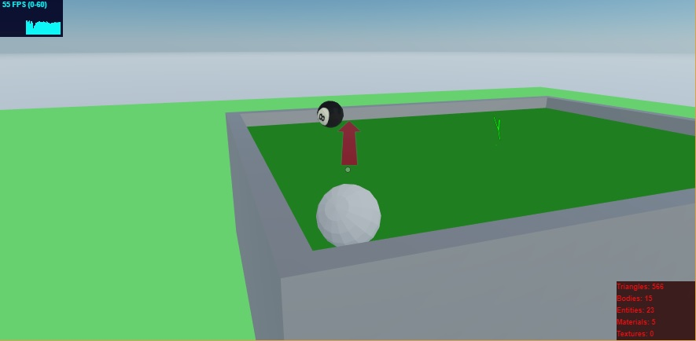

# Ball-aiming-system-for-Decentraland
A Ball-aiming-system for Decentraland with babylon.js and Typescript 
Move towards the white ball and you will see a red arrow. 

You can aim by changing your position. 
Do a left-click and hold the button. 
The longer you hold the button the more impulse/force you apply to the ball
